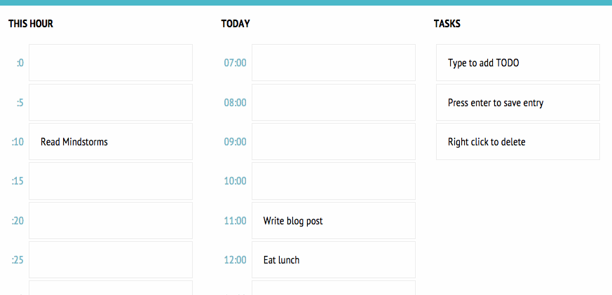

## skedu
a mashup of schedule and todo, spelled incorrectly

It's a day & hour planner / organizer. Type in your TODOs, drag and drop them to the timeslots. Helpful for final projects (except when you're spending time on building the tool). 

- Uses html5 local caching so your schedule is saved on your computer. 
- Drag & drop is html w/ javascript
- Lots of room for improvement

#### acknowledgements

- I used [makeApp.sh](https://www.lessannoyingcrm.com/blog/2010/08/149/Create+application+shortcuts+in+Google+Chrome+on+a+Mac)([gist](https://gist.github.com/demonbane/1065791)) to create a Mac Dock icon for it.
- https://github.com/zoltan-dulac/DragDropHelpers
